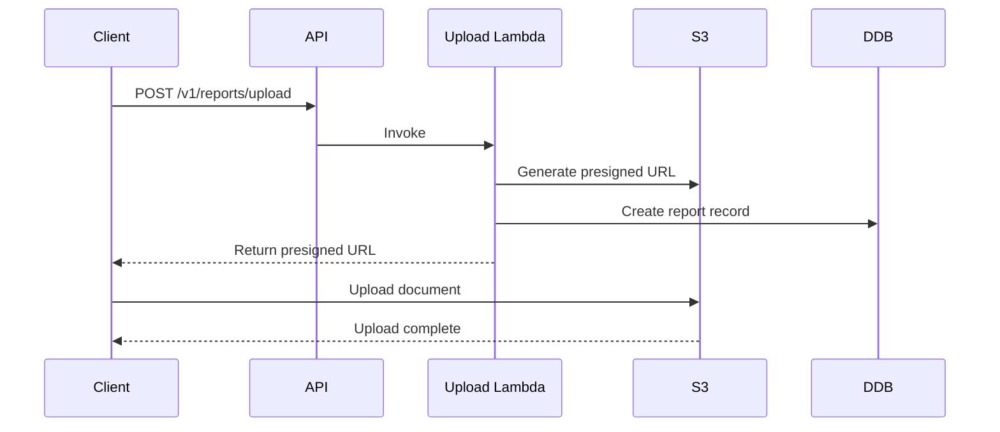
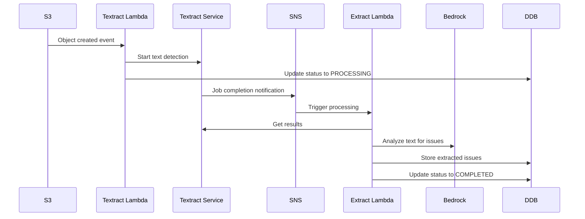
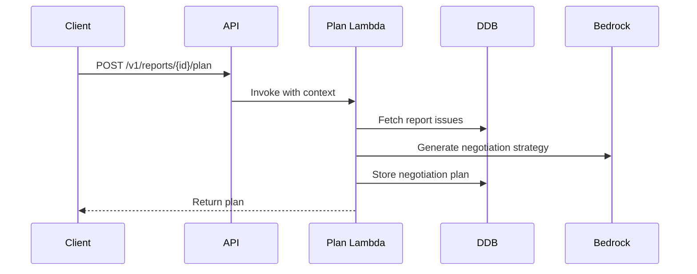

# InspectorAssist - System Design Document

## Executive Summary

**InspectorAssist** is an AI-powered property inspection analysis platform that automates the extraction of issues from inspection reports and generates strategic negotiation plans for real estate transactions. The system leverages AWS services including Textract for OCR, Bedrock for AI analysis, and a serverless architecture for scalability.

## System Architecture

### High-Level Architecture

```
┌─────────────────┐    ┌──────────────────┐    ┌─────────────────┐
│   Web Client    │───▶│   API Gateway    │───▶│   Lambda Fns    │
│   (TypeScript)  │    │   (REST API)     │    │   (Node.js)     │
└─────────────────┘    └──────────────────┘    └─────────────────┘
                                │                        │
                                ▼                        ▼
                       ┌──────────────────┐    ┌─────────────────┐
                       │   Cognito Auth   │    │   DynamoDB      │
                       │   (User Mgmt)    │    │   (Reports)     │
                       └──────────────────┘    └─────────────────┘
                                                         │
┌─────────────────┐    ┌──────────────────┐            │
│   S3 Bucket     │───▶│   AWS Textract   │────────────┘
│   (Documents)   │    │   (OCR Service)  │
└─────────────────┘    └──────────────────┘
                                │
                                ▼
                       ┌──────────────────┐
                       │   AWS Bedrock    │
                       │   (AI Analysis)  │
                       └──────────────────┘
```

### Core Components

#### 1. Frontend Application
- **Technology**: TypeScript, HTML5, CSS3
- **Location**: `/web` directory
- **Purpose**: User interface for document upload and report viewing
- **Authentication**: Cognito User Pool integration

#### 2. API Layer
- **Service**: AWS API Gateway
- **Authentication**: Cognito User Pool Authorizer
- **Endpoints**:
  - `POST /v1/reports/upload` - Generate presigned S3 URLs
  - `GET /v1/reports/{id}` - Retrieve processed reports
  - `POST /v1/reports/{id}/plan` - Generate negotiation plans

#### 3. Processing Pipeline
- **Trigger**: S3 object creation events
- **Flow**: Document Upload → OCR → AI Analysis → Report Generation
- **Coordination**: SNS topics for async processing

#### 4. Data Storage
- **Documents**: S3 bucket with versioning and encryption
- **Reports**: DynamoDB with single-table design
- **Notifications**: SNS topics for system events

## Data Models

### DynamoDB Schema (Single Table Design)

```typescript
interface ReportMetadata {
  PK: `REPORT#${reportId}`;     // Partition Key
  SK: 'METADATA';               // Sort Key
  reportId: string;
  fileName: string;
  fileSize: number;
  uploadedAt: string;
  status: 'UPLOADED' | 'PROCESSING' | 'COMPLETED' | 'ERROR';
  textractJobId?: string;
  issues?: Issue[];
  negotiationPlan?: string;
  updatedAt: string;
}

interface Issue {
  defect: string;
  location: string;
  action: 'Repair' | 'Replace' | 'Further Evaluation';
  severity: 'Low' | 'Medium' | 'High';
  description: string;
}
```

### S3 Object Structure

```
uploads-bucket/
├── uploads/                    # User uploaded documents
│   └── {reportId}.pdf
├── textract-output/           # Textract processing results
│   └── {jobId}/
└── generated-reports/         # Final processed reports
    └── {reportId}/
```

## Processing Workflows

### 1. Document Upload Workflow



### 2. Document Processing Workflow



### 3. Negotiation Plan Generation



## AI/ML Components

### 1. Document OCR (AWS Textract)
- **Purpose**: Extract text from PDF inspection reports
- **Configuration**: Asynchronous text detection
- **Output**: Structured text blocks and lines
- **Integration**: SNS notifications for completion

### 2. Issue Extraction (AWS Bedrock)
- **Model**: Amazon Titan Text Express v1 (configurable)
- **Purpose**: Identify and categorize property issues
- **Input**: OCR text from inspection reports
- **Output**: Structured JSON array of issues
- **Prompt Engineering**: Template-based prompts in `/src/lambda/prompts.ts`

### 3. Negotiation Planning (AWS Bedrock)
- **Model**: Amazon Titan Text Express v1 (configurable)
- **Purpose**: Generate strategic negotiation advice
- **Input**: Extracted issues + context parameters
- **Output**: Markdown-formatted negotiation strategy
- **Customization**: Style and context parameters

## Security Architecture

### Authentication & Authorization
- **User Management**: AWS Cognito User Pool
- **API Security**: Cognito User Pool Authorizer
- **Session Management**: JWT tokens with refresh capability
- **Password Policy**: 8+ chars, mixed case, numbers required

### Data Protection
- **Encryption at Rest**: S3 server-side encryption (SSE-S3)
- **Encryption in Transit**: HTTPS/TLS for all API calls
- **Access Control**: IAM roles with least privilege
- **Data Retention**: S3 versioning enabled, DynamoDB point-in-time recovery

### Network Security
- **S3 Access**: Block all public access
- **API Gateway**: CORS configured for web client
- **Lambda**: VPC isolation not required (serverless)
- **Service Permissions**: Textract service principal access to S3

## Operational Excellence

### Monitoring & Alerting
- **CloudWatch Alarms**: Error rate monitoring per Lambda function
- **SNS Notifications**: Real-time alerts for system issues
- **AWS X-Ray**: Distributed tracing enabled
- **Log Retention**: 30-day retention for Lambda logs

### Cost Management
- **Budget Alerts**: $200/month threshold with 80% warning
- **Resource Optimization**: Pay-per-request DynamoDB billing
- **Lambda Optimization**: Right-sized memory allocation
- **S3 Lifecycle**: Retention policies for cost control

### Reliability & Performance
- **Error Handling**: Comprehensive try-catch in all Lambda functions
- **Retry Logic**: Built-in AWS service retry mechanisms
- **Timeout Configuration**: Appropriate timeouts per function type
- **Scalability**: Serverless auto-scaling for all components

## Configuration Management

### Environment Variables
```typescript
// Lambda Environment Configuration
interface LambdaConfig {
  REPORTS_TABLE: string;           // DynamoDB table name
  UPLOADS_BUCKET: string;          // S3 bucket name
  BEDROCK_MODEL_ID: string;        // AI model identifier
  TEXTRACT_SNS_TOPIC_ARN: string; // SNS topic for notifications
  TEXTRACT_SNS_ROLE_ARN: string;  // IAM role for Textract
}
```

### CDK Configuration
```typescript
interface InspectorAssistStackProps {
  budgetThreshold?: number;  // Monthly budget limit ($200 default)
  alertEmail?: string;       // Email for alerts
}
```

## API Specification

### Authentication
All endpoints require Cognito JWT token in Authorization header:
```
Authorization: Bearer <jwt-token>
```

### Endpoints

#### Upload Document
```http
POST /v1/reports/upload
Content-Type: application/json

{
  "fileName": "inspection-report.pdf",
  "fileSize": 1048576
}

Response:
{
  "reportId": "uuid-v4",
  "uploadUrl": "https://s3.amazonaws.com/...",
  "expiresIn": 3600
}
```

#### Get Report
```http
GET /v1/reports/{reportId}

Response:
{
  "reportId": "uuid-v4",
  "fileName": "inspection-report.pdf",
  "status": "COMPLETED",
  "uploadedAt": "2024-01-01T00:00:00Z",
  "issues": [
    {
      "defect": "Roof leak",
      "location": "Master bedroom ceiling",
      "action": "Repair",
      "severity": "High",
      "description": "Water stains visible on ceiling"
    }
  ],
  "negotiationPlan": "# Negotiation Strategy\n..."
}
```

#### Generate Negotiation Plan
```http
POST /v1/reports/{reportId}/plan
Content-Type: application/json

{
  "context": "First-time buyer, competitive market",
  "style": "collaborative"
}

Response:
{
  "negotiationPlan": "# Strategic Negotiation Plan\n..."
}
```

## Deployment Architecture

### Infrastructure as Code
- **Tool**: AWS CDK (TypeScript)
- **Stack**: Single stack deployment
- **Resources**: ~15 AWS resources per environment
- **Environments**: Development, Production

### CI/CD Pipeline
```bash
# Build and test
npm run build
npm run test

# Deploy infrastructure
npm run synth    # Generate CloudFormation
npm run deploy   # Deploy to AWS
```

### Resource Naming Convention
```
InspectorAssist-{Environment}-{ResourceType}-{Identifier}
```

## Performance Characteristics

### Expected Throughput
- **Document Upload**: 100 concurrent uploads
- **Processing Time**: 2-5 minutes per document
- **API Response**: <500ms for data retrieval
- **Bedrock Latency**: 10-30 seconds for AI analysis

### Scaling Limits
- **Lambda Concurrency**: 1000 concurrent executions (default)
- **DynamoDB**: 40,000 RCU/WCU on-demand
- **S3**: Unlimited storage and requests
- **Textract**: 600 pages/minute (adjustable)

## Future Enhancements

### Phase 2 Features
1. **Multi-format Support**: Word docs, images, scanned PDFs
2. **Batch Processing**: Multiple documents per report
3. **Custom Templates**: User-defined issue categories
4. **Integration APIs**: MLS, CRM system connections

### Technical Improvements
1. **Caching Layer**: ElastiCache for frequently accessed data
2. **Search Capability**: OpenSearch for issue discovery
3. **Real-time Updates**: WebSocket API for live status
4. **Mobile App**: React Native client application

## Appendices

### A. Error Codes
- `UPLOAD_001`: Invalid file format
- `PROCESS_001`: Textract job failed
- `AI_001`: Bedrock model unavailable
- `DATA_001`: DynamoDB operation failed

### B. Monitoring Dashboards
- Lambda function performance metrics
- API Gateway request/response patterns
- Cost analysis and budget tracking
- User activity and engagement metrics

### C. Disaster Recovery
- **RTO**: 4 hours (Recovery Time Objective)
- **RPO**: 1 hour (Recovery Point Objective)
- **Backup Strategy**: Cross-region S3 replication
- **Data Recovery**: DynamoDB point-in-time recovery

---

*Document Version: 1.0*  
*Last Updated: January 4, 2026*  
*Generated from codebase analysis*
